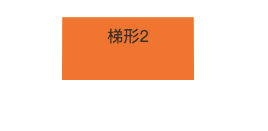

# 画个梯形 - 《css揭秘》笔记

在以前，(是以前！) 梯形确实不太好画出来啊。。。

### 实现方案
在三维的世界中旋转一个矩形，因为透视关系，最终看到的二维图像就是一个梯形啦  
` transform: perspective(.5em)  rotateX(5deg);`

但是因为对整个元素进行了3D变形，所以里面的文字也变形了。有一点值得注意：**对元素使用了3D变形后，内部的变形效应是『不可逆转』的**。 但是2D变形体系下内部的逆向变形是可以抵消外部的变形效应的。

所以唯一的方法就是把变形效果作用在 **伪元素** 上。如图：


``` css
div {
	position: relative;
	width: 100px;
	height: 50px;
	margin: 20px auto;
	padding: .5em 1em .35em;
	text-align: center;
	color: #fff;
}
div:before {
	content: '';
	position: absolute;
	top: 0;
	bottom: 0;
	left: 0;
	right: 0;
	z-index: -1;
	background: #f60;
	transform: perspective(.5em)  rotateX(5deg);
}
```

虽然已经实现了一个梯形，当我们没有设置 `transform-origin` 属性时，变形效果会让这个元素以它自身中心线为轴进行空间上的旋转。

从上面的gif图也能看出，它的宽度会增加，位置会下移，高度上也会有减小，这样会在设计上比较难控制。

所以添加 `transform-origin: bottom`, **当它在 3D 空间旋转时可以把它的底边固定住**。



但是这样高度会有明显的缩水，以为现在整个元素是转离屏幕前观众的；之前元素上半部分转向屏幕后面，下半部分转出屏幕。相比之下，3D空间中，之前的元素总体上里观众更近了。

所以解决方案是：**通过变形属性改变尺寸**。 试验后得知一个 magic number：`scaleY(1.3)` 来弥补高度上的缩水。

```css
.trap3:before {
	transform: perspective(.5em) rotateX(5deg) scaleY(1.3);
	transform-origin: bottom;
}
```

效果明显


### 其他倾斜方向

只需要把 `transform-origin` 改为 `bottom left` 或者 `bottom right` 即可

```css
.trap4:before {
    transform: perspective(.5em)  rotateX(5deg) scaleY(1.3);
    transform-origin: bottom left;
}
.trap5:before {
    transform: perspective(.5em)  rotateX(5deg) scaleY(1.3);
    transform-origin: bottom right;
}
```


## demo地址

[http://ccforward.github.io/css-secrets/trapezoid/index.html](http://ccforward.github.io/css-secrets/trapezoid/index.html)

## 参考

* 《css解密》 3-13:梯形标签页


