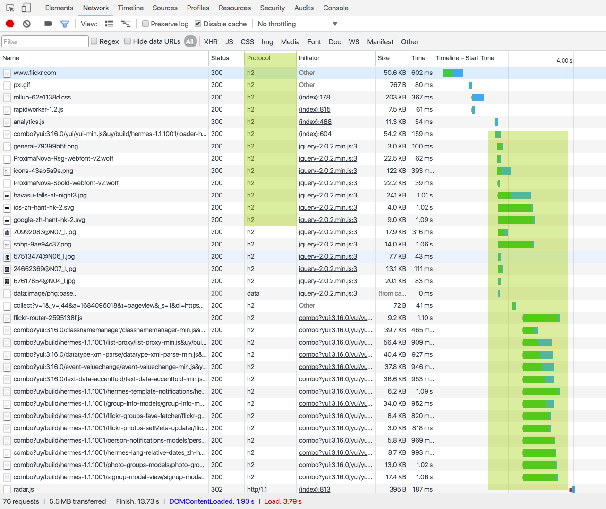

# HTTP/2 + Node.js

HTTP/2是基于Google的SPDY协议为基础开发的新的web协议。HTTP/2算是从1991年以来HTTP的第一次重大升级。

Yahoo 旗下的 [Flickr](https://www.flickr.com/) 貌似在2016年7月开始用上了HTTP2，如图



虽然 HTTP/2 是基于 SPDY 协议开发的，但是两者还是有不同点的：

  1. HTTP/2支持明文的HTTP传输，但是SPDY强制要求使用HTTPS
  2. HTTP/2 消息头的压缩算法采用 [HPACK](http://http2.github.io/http2-spec/compression.html)，而非 SPDY 采用的 [DEFLATE](http://zh.wikipedia.org/wiki/DEFLATE)

HTTP2的优势：

  * 多路复用：在一个TCP连接中将所有请求并发完成。
  * 服务端推送：服务端可以在客户端确认需要资源(js css)之前把资源推送到客户端，而不是客户端解析了HTML之后再做请求
  * 数据流优先(Stream priority)：HTTP/2采用二进制格式传输数据，而不是HTTP/1.x的那种文本格式。
  * 报头压缩：HTTP/2对报头采用 HPACK 算法进行压缩后传输，节省流量。
  * 强制加密：虽然加密不是强制的，但是多数浏览器都是通过TLS(HTTPS)实现的HTTP/2

因为我们基于node实现的h2用的是spdy模块，所以必须建立在https的基础上，先生成自签名的证书

```bash
$ mkdir h2-node
$ cd h2-node
$ openssl genrsa -des3 -passout pass:x -out server.pass.key 2048 
$ openssl rsa -passin pass:x -in server.pass.key -out server.key
$ openssl req -new -key server.key -out server.csr
# ...
# 输入证书相关信息（随意填写）
# ...
$ openssl x509 -req -sha256 -days 365 -in server.csr -signkey server.key -out server.crt
$ rm server.pass.key
```

初始化 package.json 文件并添加 spdy 和 express 模块

``` 
npm init
npm i express spdy --save
```

新建一个 index.js 文件作为应用入口

```js
const spdy = require('spdy');
const express = require('express');
const path = require('path');
const fs = require('fs');
```

添加 express 并配置路由

```
const port = 3000;
const app = express();

app.get('*', (req, res) => {
    res
      .status(200)
      .json({error: 0, msg:'http2 OK'});
})
```