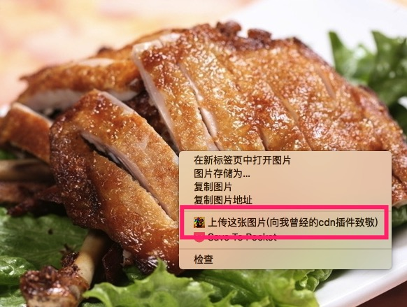

# 上传七牛的chrome扩展

七牛的10G [免费云存储](http://www.qiniu.com/pricing) 一直没用，正好现在拿这个做自己的cdn图床。(其实现在付费cdn的存储和流量都超便宜)

chrome扩展就是在图片上右键上传img标签里的图片，本地和远程图片都可上传。



## 1、七牛的API接口

新版本的七牛上传 [node-sdk](http://developer.qiniu.com/code/v6/sdk/nodejs.html#io-put) 比以前简化了很多代码，更好用了

代码 [在这](https://github.com/ccforward/qiniu/blob/master/api.js) 也就20几行，很简单。

## 2、一个HTTP服务

这一步也简单，直接 `http.createServer` 来提供一个接口获取图片的地址，然后重点就是下一步，上传图片。

## 3、上传

1. 上传前先下载到临时目录  
	* 根据图片的url判断使用 http 还是 https 模块
	* 通过HTTP响应头判断图片的大小和格式(通过文件名后缀判断格式绝对不靠谱)
	* 符合预设的大小和格式后下载到tmp文件里后调用上传方法
2. 上传临时目录的图片
	* 这里要判断是远程线上图片还是本地在浏览器打开的图片  
	* 对于本地的图片地址要做 `decodeURI(url.replace('file://',''))` ，不然node找不到文件(这里被坑了一下)  
	* 本地图片获取文件大小和格式

		```js
		var localURL = decodeURI(url.replace('file://','')),
  			size = fs.statSync(localURL).size / (1024*1024),
			format = path.extname(localURL).split('.').pop();
		```
	文件格式只是从路径中读取，可能会出问题，暂时先这样用。

## 4、chrome 扩展
有个类似插件之前就在公司内部用过，现在把最基本功能挪出来。

先做一个简单版本，只添加了图片右键监听，点击后发送一个ajax请求到第2步中HTTP提供的接口里，异步调用上传接口。

```js
chrome.contextMenus.create({
    "type": "normal",
    "title": "上传这张图片(向我曾经的cdn插件致敬)",
    "contexts": ["image"],
    "onclick": evt
});
```
[右键点击事件监听](https://github.com/ccforward/qiniu/blob/master/chrome/background.js#L1)

## 5、TODO

1. 加一个微博的图床接口，可以手动切换
2. 本地记录上传的日志
3. 还没想，反正基本自己用

