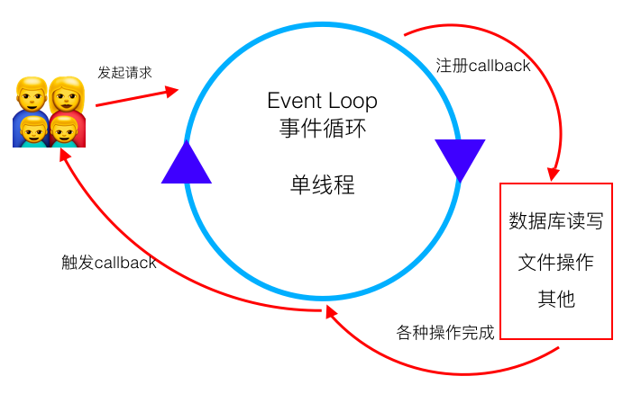
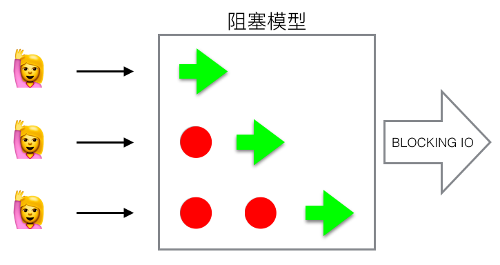
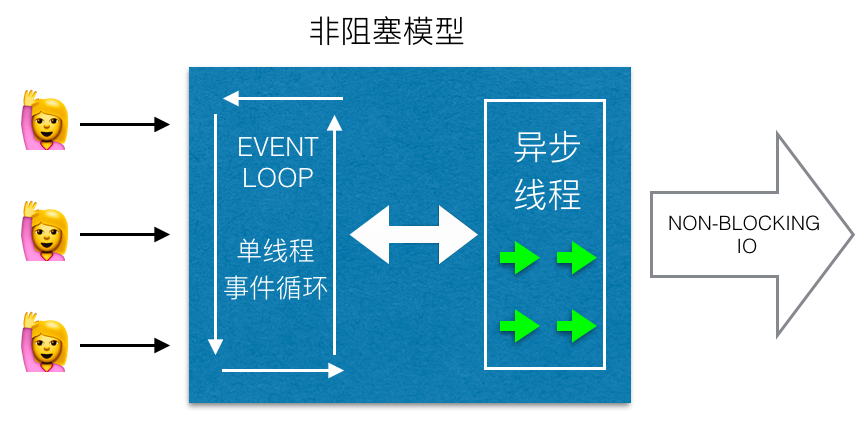
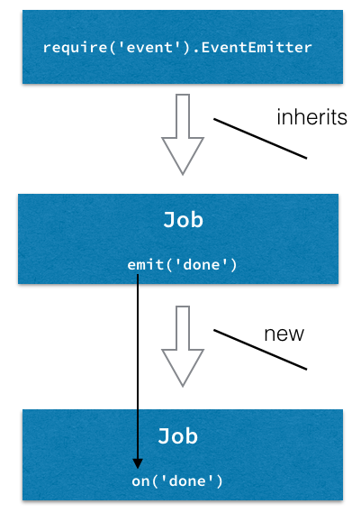
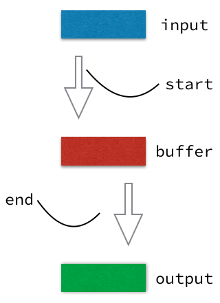
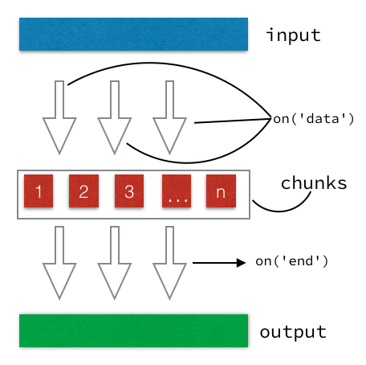

# Node.js的核心Feature

>
1. Event Loop 事件循环
2. global 和 process
3. Event Emitters 事件触发
4. Stream 和 Buffer
5. Cluster 集群
6. 异步Error
7. C++ 插件
>


## Event Loop

事件循环算是Node的一个核心了，即使进程中有I/O调用也能处理其他任务。正因为阻塞I/O代价太高所以就凸显了Node的高效。



> ps: keynote做的图，不会PS，太麻烦。。。

在 Python 这样来实现一个延迟处理

```python
import time

print "Step 1"
print "Step 2"
time.sleep(2)
print "Step 3"
```

Node或JS 通过异步回调的方式来实现

```js
console.log('Step 1')
setTimeout(function () {
  console.log('Step 3')
}, 2000)
console.log('Step 2')
```

可以事件循环想象成一个for或while循环，只有在现在或将来没有任务要执行的时候才会停下来。



在等待I/O任务完成之前就可以做更多事情，事件循环因此让系统更加高效。



Node也让我们从死锁中解放，因为根本没有锁。

PS：我们仍然可以写出阻塞的代码

```js
var start = Date.now()
for (var i = 1; i<1000000000; i++) {}
var end = Date.now()
console.log(end-start)
```
这次的阻塞在我的机器上花了3400多毫秒。不过我们多数情况下不会跑一个空循环。

而且fs模块提供了同步(阻塞)和异步(非阻塞)两套处理方法(区别于方法名后是否有Sync)

如下阻塞方式的代码:

```js
var fs = require('fs');
	
var con1 = fs.readFileSync('1.txt','utf8');
console.log(con1);
console.log('read 1.txt');
	
var con2 = fs.readFileSync('2.txt','utf8');
console.log(con2);
console.log('read 2.txt');
```
结果就是

`content1->read 1.txt->content2->read 2.txt`

非阻塞方式的代码:

```js
var fs = require('fs');

fs.readFile('1.txt','utf8', function(err, contents){
   console.log(contents);
});
console.log('read 1.txt');

fs.readFile('2.txt','utf8', function(err, contents){
   console.log(contents);
});
console.log("read 2.txt");
```

代码执行后因为要花时间执行**读**的操作，所以会在最后的回调函数中打印出文件内容。当读取操作结束后事件循环就会拿到内容

`read 1.txt->read 2.txt->content1->content2 `

事件循环的概念对前端工程师比较好理解，关键就是异步、非阻塞I\O。

## global

从浏览器端切换到Node端就会出现几个问题

  * 全局变量如何创建(window对象已经没了)
  * 从 CLI 输入的参数、系统信息、内存信息、版本信息等从哪获取

有一个 global 对象，顾名思义就是全局的，它的属性很多

  * global.process 可获取版本信息、CLI 参数、内存使用(process.memoryUsage()这个函数很好用)
  * global.__filename 当前脚本的文件名、路径
  * global.__dirname 当前脚本绝对路径
  * global.module 最常见的模块输出
  * global.require() 模块引入
  * global.console()、setInterval()、setTimeout() 这些浏览器端的方法也在global对象下面

在命令行里执行一次 global 一切就都懂了。

## process

通过process对象获取和控制Node自身进程的各种信息。另外process是一个全局对象，在任何地方都可以直接使用。

部分属性

  * process.pid  进程pid
  * process.versions node v8 ssl zlib 等组件的版本
  * process.arch 系统架构 如:x64
  * process.argv CLI 参数
  * process.env 环境变量

部分方法

  * process.uptime() 正常运行的时长
  * process.memoryUsage() 内存使用情况
  * process.cwd() 当前目录
  * process.exit() 退出进程
  * process.on() 添加事件监听 比如：on('uncaughtException')

## Events

Events == Node Observer Pattern

异步处理写多了就会出现callbackhell（回调地狱），还有人专门做了叫 callbackhell 的[网站](http://callbackhell.com)。

Event Emitters就是可以触发任何可监听的事件，callbackhell可以通过事件监听和触发来避免。

#### 用法

```js
var events  = require('events');
var emitter = new events.EventEmitter();
```

添加事件监听和事件触发

```
emitter.on('eat', function() {
  console.log('eating...')
})

emitter.on('eat', function() {
  console.log('still eating...')
})

emitter.emit('eat')
```

假设我们有一个已经继承了EventEmitter的类，能每周、每天的处理邮件任务，而且这个类具有足够的可扩展性能够自定义最后的输出内容，换言之就是每个使用这个类的人都能够在任务结束时增加自定义的方法和函数。

如下图，我们继承了EventEmitter模块创建了Class: Job，然后通过事件监听器 done 来实现Job的自定义处理方式。



我们需要做的只是在进程结束的时候触发 done 事件：

```js
// job.js
var util = require('util');
var Job = function Job() {
  var job = this;
  // ...
  job.process = function() {
    // ...
    job.emit('done', { completedOn: new Date() })
  }
}

util.inherits(Job, require('events').EventEmitter);
module.exports = Job;
```

我们的目的是在 Job 任务结束时执行自定义的函数方法，因此我们可以监听 done 事件然后添加回调：

```js
// weekly.js
var Job = require('./job.js')
var job = new Job()

job.on('done', function(details){
  console.log('Job was completed at', details.completedOn)
  job.removeAllListeners()
})

job.process()
```

关于 emitter 还有这些常用方法

  * emitter.listeners(eventName) 列出 eventName 的所有监听器
  * emitter.once(eventName, listener) 只监听一次
  * emitter.removeListener(eventName, listener) 删除监听器

  
## stream 流

用Node处理比较大的数据时可能会出现些问题：
  
  * 速度较慢
  * 缓冲器只限制在1GB上等，
  * 数据连续不断的时如何何操作

用Stream就会解决。因为Node的 Stream 是对连续数据进行分块后的一个抽象，也就是不需要等待资源完全加载后再操作。

标准Buffer的处理方式：



只有整个Buffer加载完后才能进行下一步操作，看图对比下Node的Stream，只要拿到数据的第一个 chunk 就可以进行处理了



Node中有四种数据流：
  
  1. Readable 读
  2. Writable 写
  3. Duplex 读&写
  4. Transform 数据转换
 
Stream在Node中很常见：
  
  * HTTP 的 request response
  * 标准 I/O
  * 文件读写

#### Readable Stream
process.stdin 是一个标准输入流，数据一般来自于键盘输入，用它来实现一个可读流的例子。

我们使用 `data` 和 `end` 事件从 `stdin` 中读取数据。其中 data 事件的回调函数的参数就是 chunk 。

```js 
process.stdin.resume()
process.stdin.setEncoding('utf8')

process.stdin.on('data', function (chunk) {
  console.log('chunk: ', chunk)
})

process.stdin.on('end', function () {
  console.log('--- END ---')
})
```

PS: stdin 默认是处于pause状态的，要想读取数据首先要将其 resume()

可读流还有一个**同步**的 read() 方法，当流读取完后会返回 chunk或null ，课这样来用：

```
var readable = getReadableStreamMethod()
readable.on('readable', () => {
  var chunk
  while (null !== (chunk = readable.read())) {
    console.log('got %d bytes of data', chunk.length)
  }
})
```

我们在Node中要尽可能写异步代码避免阻塞线程，不过好在 chunk 都很小所以不用担心同步的 read() 方法把线程阻塞

#### Writable Stream 
我们用 process.stdin 对应的 process.stdout 方法来实现个例子

```
process.stdout.write('A simple message\n')
```

把数据写入标准输出后是在命令行中可见的，就像用 console.log()

#### Pipe
就像自来水要有自来水管一样，Stream 需要传送 也需要 Pipe。

下面的代码就是从文件中读数据，然后GZip压缩，再把数据写入文件

```js
const r = fs.createReadStream('file.txt')
const z = zlib.createGzip()
const w = fs.createWriteStream('file.txt.gz')
r.pipe(z).pipe(w)
```

readable.pipe() 方法从可读流中拉取所有数据，并写入到目标流中，同时返回目标流，因此可以链式调用(也可以叫导流链)。  
PS:该方法能自动控制流量以避免目标流被快速读取的可读流所淹没。


#### HTTP 流
web应用最常见了，HTTP 流用的也最多。

request 和 response 是继承自Event Emitter的可读可写流。下面的代码在各种教程中就很常见了：

```js
const http = require('http')
var server = http.createServer( (req, res) => {
  var body = '';
  req.setEncoding('utf8');
  req.on('data', (chunk) => {
    body += chunk;
  })
  req.on('end', () => {  
    var data = JSON.parse(body);
    res.write(typeof data);
    res.end();
  })
})

server.listen(5502)
```

**之前还写过一篇关于 Stream 和 Pipe 的文章：[Node.js 使用 fs 模块做文件 copy 的四种方法](https://github.com/ccforward/cc/issues/21)** 能清楚的比较出使用Stream后能更快的获取到数据。

#### Buffer

浏览器中的JS没有二进制类型的数据(除了ES6中ArrayBuffer)，但是Node里面有，就是 Buffer。 Buffer是个全局对象，可直接使用来创建二进制数据：

  * Buffer.alloc(size)
  * Buffer.from(array)
  * Buffer.from(buffer)
  * Buffer.from(string[, encoding])

[官方API](https://nodejs.org/api/buffer.html#buffer_buffer)中有最全的方法。
 
标准的Buffer数据比较难看懂，一般用 `toString()` 来转换成人类可读的数据

```js
let buf = Buffer.alloc(26)
for (var i = 0 ; i < 26 ; i++) {
  buf[i] = i + 97 // 97 is ASCII a
}

console.log(buf) // <Buffer 61 62 63 64 65 66 67 68 69 6a 6b 6c 6d 6e 6f 70 71 72 73 74 75 76 77 78 79 7a>

buf.toString('utf8') //  abcdefghijklmnopqrstuvwxyz
buf.toString('ascii') // abcdefghijklmnopqrstuvwxyz

// 截取
buf.toString('utf8', 0, 5) // abcde
buf.toString(undefined, 0, 5) // abcde  编码默认是 utf8
```

fs 模块的 readFile 方法回调中的data就是个Buffer

```js
fs.readFile('file-path', function (err, data) {
  if (err) return console.error(err)
  console.log(data)
});
```


## Cluster 集群

单个 Node 实例运行在单个线程中。要发挥多核系统的能力，就需要启动一个 Node 进程集群来处理负载。核心模块 cluster 可以让一台机器的所有 CPU 都用起来，这样就能纵向的来扩展我们的Node程序。

```
var cluster = require('cluster');
var numCPUs = 4; // 我的 MacBook Air 是4核的
if (cluster.isMaster) {
  for (var i = 0; i < numCPUs; i++) {
    cluster.fork()
  }
} else if (cluster.isWorker) {
	console.log('worker')
})
```

上面的代码比较简单，引入模块创建一个 master 多个 worker，不过 numCPUs 并一定非得是一台电脑的核心数，这个可以根据自己需求想要多少都行。

worker 和 master 可以监听相同的端口，worker通过事件和master通信。master也能监听事件并根据需要重启集群。


#### 重要代表 pm2

pm2优点很多：

  * 负载均衡
  * 热重载：0s reload
  * 非常好的测试覆盖率

pm2 启动很简单：

`$ pm2 start server.js -i 4 -l ./log.txt`

  * -i 4 是 cpu数量（我是4核的）
  * -l ./log.txt 打日志

pm2 启动后自动到后台执行 通过 `$ pm2 list` 可以查看正在跑着那些进程。

更多内容直接看官网: [http://pm2.keymetrics.io/](http://pm2.keymetrics.io/)

### Spawn vs Fork vs Exec

`child_process.spawn()` vs `child_process.fork()` vs `child_process.exec()`

Node中有如上三种方式创建一个外部进程，而且都来自于核心模块 `child_process`

  * `require('child_process').spawn()` 用于比较大的数据，支持流，可以与任何命令(bash python ruby 以及其他脚本)一起使用，并且不创建一个新的V8实例

  [官网的例子](https://nodejs.org/api/child_process.html#child_process_child_process_spawn_command_args_options)就是执行了一个bash命令
  * `require('child_process').fork()` 创建一个新的V8实例，实例出多个worker

  和spawn不同的的是 fork 只执行 node 命令
  * `require('child_process').exec()` 使用Buffer，这使得它不适合比较大的数据和Stream，异步调用，并在回调一次性拿到所有数据

 exec()用的不是事件模式，而是在回调中返回 stdout stderr


## 处理异步 Error
处理异常一般都用 try/catch ,尤其是在同步代码非常好用，但是在异步执行中就会出现问题

```js
try {
  setTimeout(function () {
    throw new Error('Fail!')
  }, 1000)
} catch (e) {
  console.log(e.message)
}
```

这种异步的回调里面情况肯定catch不到错误，当然把try/catch放入回调函数肯定没问题，但这并不是个好办法。

所以Node里面标准的回调函数的第一个参数都是 error ,于是就有了这样的代码

```js
if (error) return callback(error)
```

一般处理异步异常的方法如下：

* 监听所有的 on('error')
* 监听 uncaughtException
* 用 domain 模块 或者 [AsyncWrap](http://blog.trevnorris.com/2015/02/asyncwrap-tutorial-introduction.html)
* 打日志
* 退出然后重启进程。。。。

#### uncaughtException

uncaughtException是一种很简单粗暴的机制，当一个异常冒泡到事件循环中就会触发这个事件，不过这个不建议使用。

```js
process.on('uncaughtException', function (err) {
  console.error('uncaughtException: ', err.message)
  console.error(err.stack)
  process.exit(1)
})
```

#### Domain

domain自身其实是一个EventEmitter对象，它通过事件的方式来传递捕获的异常。

进程抛出了异常，没有被任何的try catch捕获到，这时候将会触发整个process的processFatal，此时如果在domain包裹之中，将会在domain上触发error事件，反之，将会在process上触发uncaughtException事件。

用法：

```js
var domain = require('domain').create()

d.on('error', function(e) {
   console.log(e)
})
d.run(function() {
  setTimeout(function () {
    throw new Error('Failed!')
  }, 1000)
});
```

**从 4.0 开始Node已经不建议使用了，以后也会被剥离出核心模块**

## C++ 插件

Node.js在硬件、IoT领域开始流行就是因为能和 C/C++ 代码合体使用。

官方提供了很多C++插件的例子：[https://github.com/nodejs/node-addon-examples](https://github.com/nodejs/node-addon-examples)

以第一个HelloWorld为例：

创建 hello.cc 文件，这个代码比较好理解

```cpp
#include <node.h>

namespace demo {

using v8::FunctionCallbackInfo;
using v8::HandleScope;
using v8::Isolate;
using v8::Local;
using v8::Object;
using v8::String;
using v8::Value;

void Method(const FunctionCallbackInfo<Value>& args) {
  Isolate* isolate = args.GetIsolate();
  args.GetReturnValue().Set(String::NewFromUtf8(isolate, "Hello World C++ addon")); // 输出Hello World
}

void init(Local<Object> exports) {
  NODE_SET_METHOD(exports, "hello", Method); // Exporting
}

NODE_MODULE(addon, init)

}  
```

创建binding.gyp文件 内容一看就懂

```json
{
  "targets": [
    {
      "target_name": "addon",
      "sources": [ "hello.cc" ]
    }
  ]
}
```

依次执行两个命令

```
$ node-gyp configure
$ node-gyp build
```

编译完成后在 build/Release/ 下面会有一个 addon.node 文件

然后就简单了创建 h.js

```
var addon = require('./build/Release/addon')
console.log(addon.hello()) 
```

执行 `$ node hello.js`  打印出了 `Hello World C++ addon`


OVER....

PS: 文中图片都是用keynote制作的

部分参考和翻译自：

* [https://nodejs.org/api/](https://nodejs.org/api/)
* [http://www.ruanyifeng.com/blog/2014/10/event-loop.html](http://www.ruanyifeng.com/blog/2014/10/event-loop.html)
* [http://webapplog.com/you-dont-know-node/](http://webapplog.com/you-dont-know-node/)
* [https://cnodejs.org/topic/516b64596d38277306407936](https://cnodejs.org/topic/516b64596d38277306407936)
