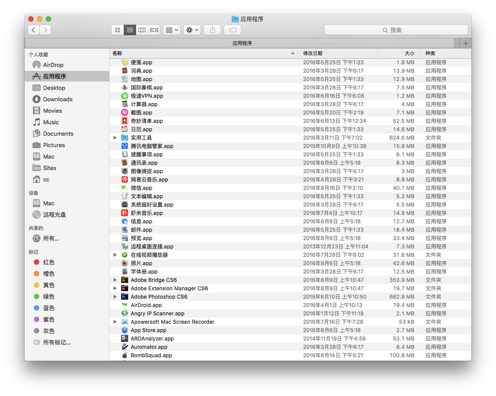
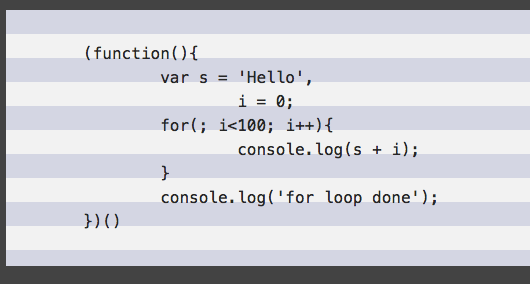

# 给文本画上斑马线

就像这样，隔行换背景色（这种情况在页面中显示源码情况下比较常见）



## 1、先画斑马线

斑马线、条纹图案用css的背景线性渐变就能实现

```css
/* 水平条纹 */
background: linear-gradient(#f06 50%, #fff 0);
background-size: 100% 30px;

/* 垂直条纹 */
background: linear-gradient(to right, #f06 50%, #fff 0);
background-size: 30px 100%;
```

上面代码 `linear-gradient(#f06 50%, #fff 0)` 中，第二个色标的位置值为 **`0`** ，那它的位置就会被浏览器调整为前一个色标的位置值。

三种颜色的条纹，也很简单：

```
/*  三种颜色  */
background: linear-gradient(#f06 33.3%, #9c0 0, #9c0 66.6%, #58a 0);
```

直接看demo：

  * [水平条纹](http://ccforward.github.io/css-secrets/zebra-lines/1.html)
  * [垂直条纹](http://ccforward.github.io/css-secrets/zebra-lines/1.html)

## 2、添加文本

其实，把每行文本放入一个 div 中，用 `:nth-child()` 来实现斑马条纹也可以，但是 DOM 过多明显会拖累页面性能。

所以按照第一步，画出条纹背景，并用 `em` 单位来设定背景尺寸，这样背景就可以自适应`font-size`的变化了；并且它的 `background-size` 为 `line-height` 的两倍（因为每条背景要覆盖两行文本）

```css
pre {
	width: 100%;
	padding: .5em 0;
	line-height: 1.5;
	background: #f5f5f5;
	background-image: linear-gradient(rgba(0,0,120,.1) 50%, transparent 0);
	background-size: auto 3em;
	color: #333;
	font-size: 16px;
}
```



[斑马条纹demo1](http://ccforward.github.io/css-secrets/zebra-lines/3.html)

## 3、解决问题

如上图，有两个问题：

1. 代码和条纹是错位的
2. 代码缩进的 tab 宽度明显太宽了

#### 1.错位问题

设置 `background-origin: content-box;` 让浏览器在解析 `background-origin` 时候以 content box 的外沿为基准，而不是默认的 padding box。

#### 2.tab 缩进问题

这个简单，因为源码中用的 tab 不是空格，所以浏览器会把缩进的tab默认显示为 8 个字符

只需要加入css3的新特性

```css
pre {
	tab-size: 2;  // tab为2个字符
}
```

[最终的效果](http://ccforward.github.io/css-secrets/zebra-lines/index.html)
