# Node.js 事件循环

多数的网站不需要大量计算，程序花费的时间主要集中在磁盘 I/O 和网络 I/O 上面

SSD读取很快，但和CPU处理指令的速度比起来也不在一个数量级上，而且网络上一个数据包来回的时间更慢：

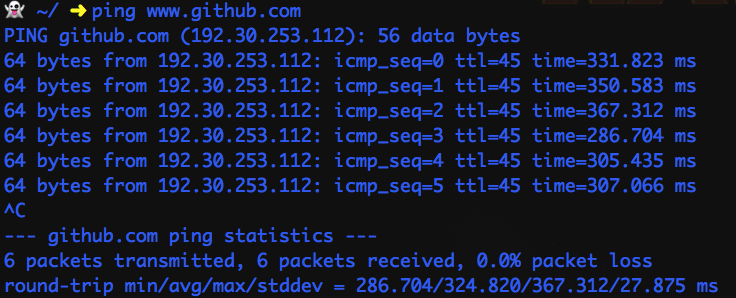

一个数据包来回的延迟平均320ms(我网速慢，ping国内网站会更快)，这段时间内一个普通 cpu 执行几千万个周期应该没问题

因此异步IO就要发挥作用了，比如用多线程，如果用 Java 去读一个文件，这是一个阻塞的操作，在等待数据返回的过程中什么也干不了，因此就开一个新的线程来处理文件读取，读取操作结束后再去通知主线程。

这样虽然行得通，但是代码写起来比较麻烦。像 Node.js V8 这种无法开一个线程的怎么办？

## 栈 Stack

当我们调用一个函数，它的地址、参数、局部变量都会压入到一个 stack 中

```js
function fire() {
    const result = sumSqrt(3, 4)
    console.log(result);
}
function sumSqrt(x, y) {
    const s1 = square(x)
    const s2 = square(y)
    const sum = s1 + s2;
    return Math.sqrt(sum)
}
function square(x) {
    return x * x;
}

fire()
```


`fire()` 首先被调用

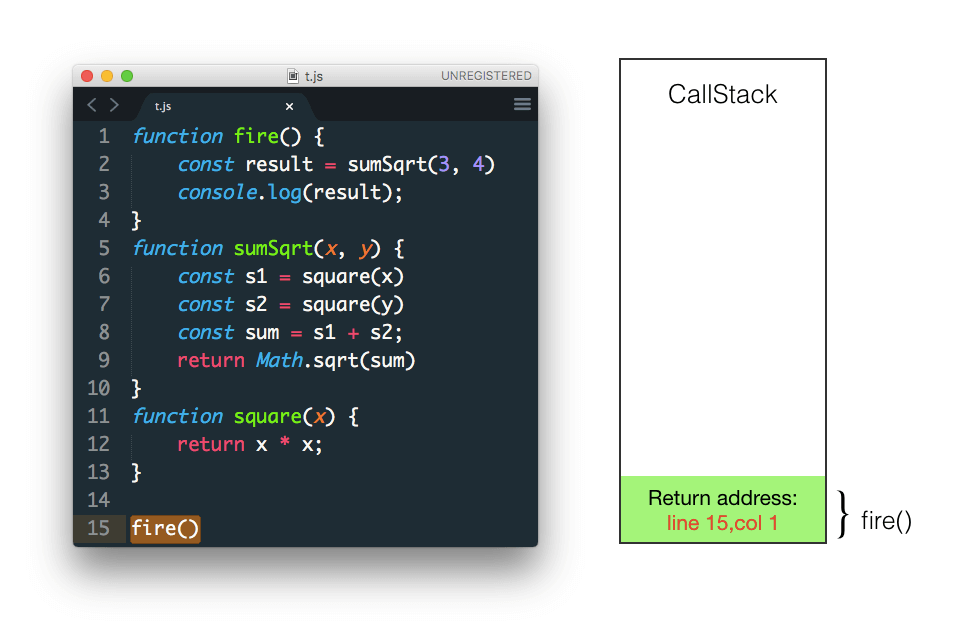

`fire` 调用 `sumSqrt` 函数 参数为3和4

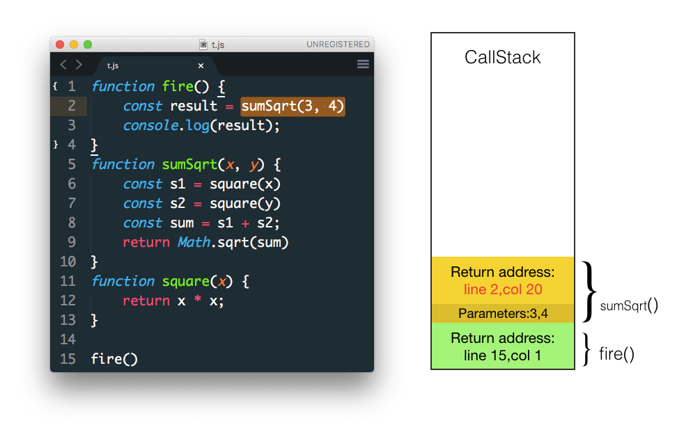

之后调用 `square` 参数为 x, x==3

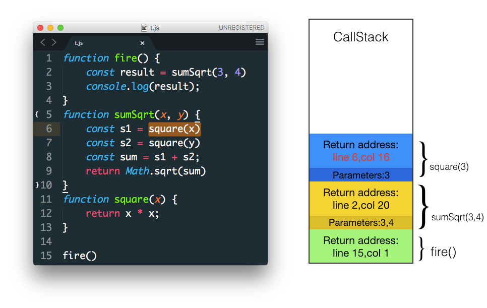


当 `square` 执行结束返回时，从 stack 中弹出，并将返回值赋值给 s1  
s1加入到 sumSqrt 的 stack frame 中

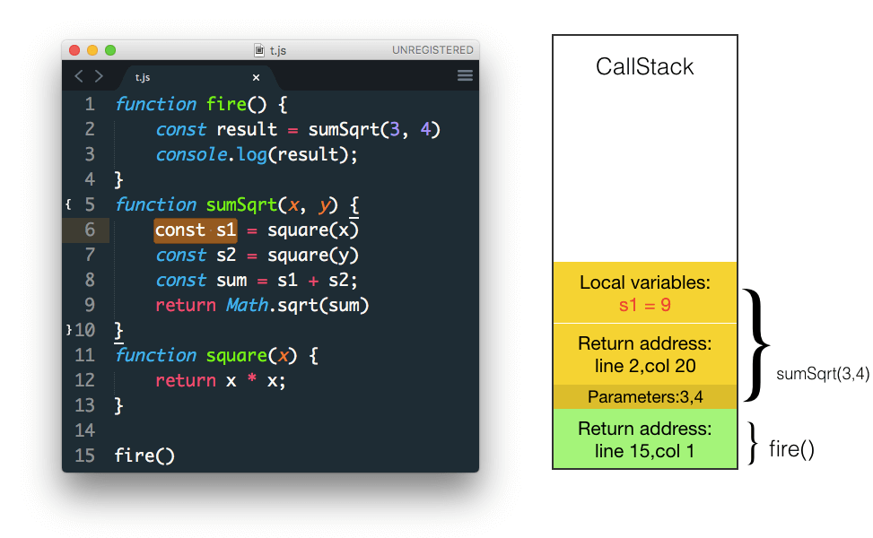

以同样的方式调用下一个 `square` 函数

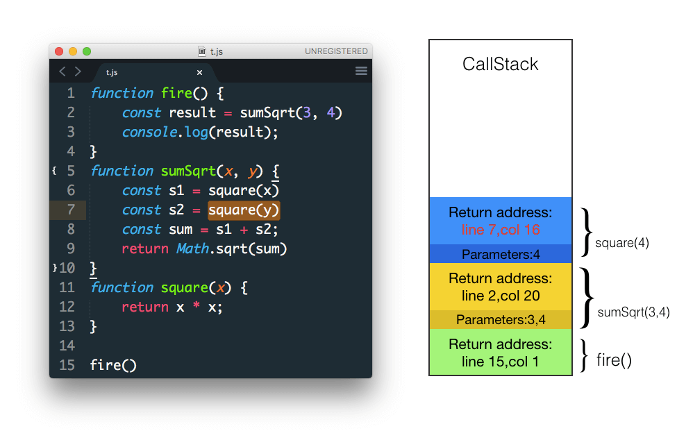

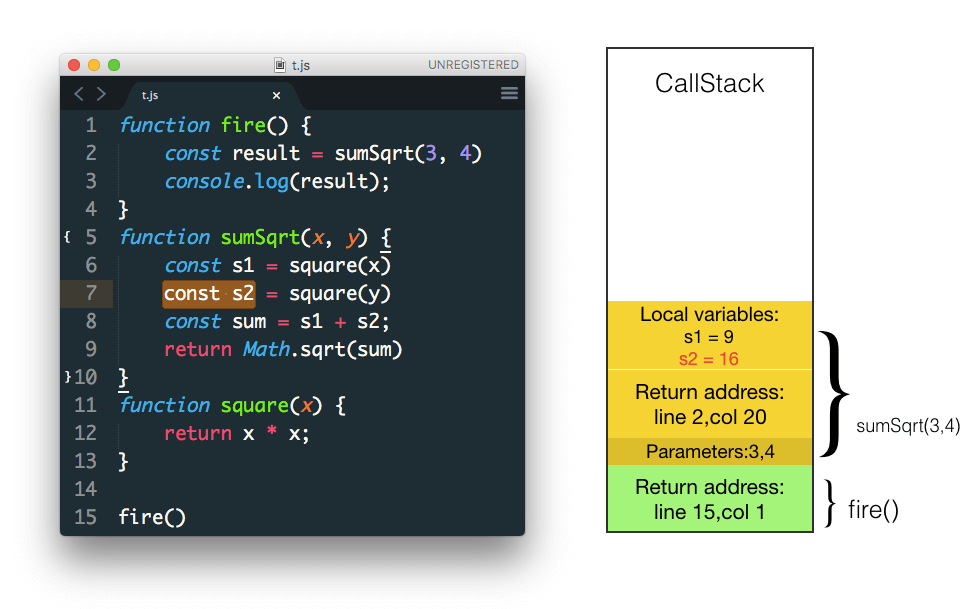

在下一行的表达式中计算出 s1+s2 并赋值给 sum

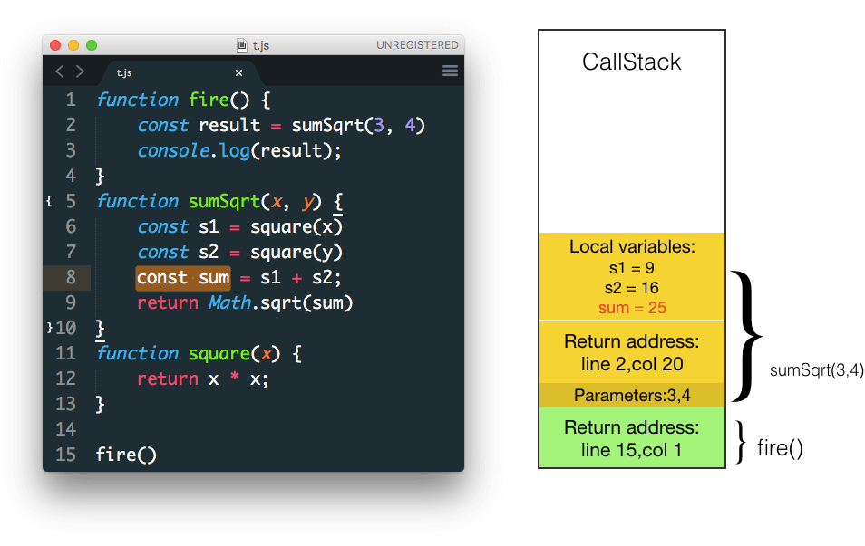

之后调用 `Math.sqrt` 参数为sum

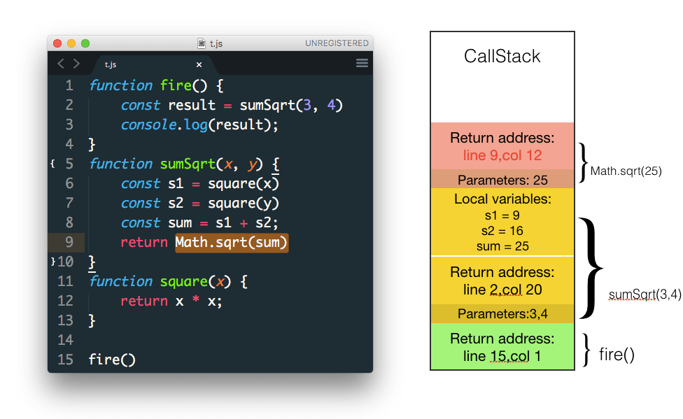

现在就剩下 `sumSqrt` 函数返回计算结果了

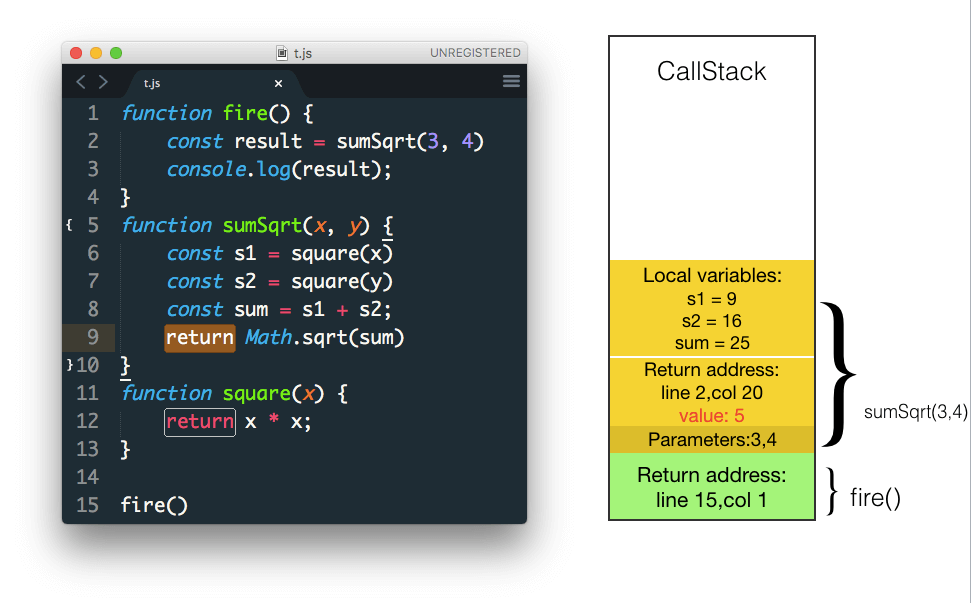

返回值赋值给 result

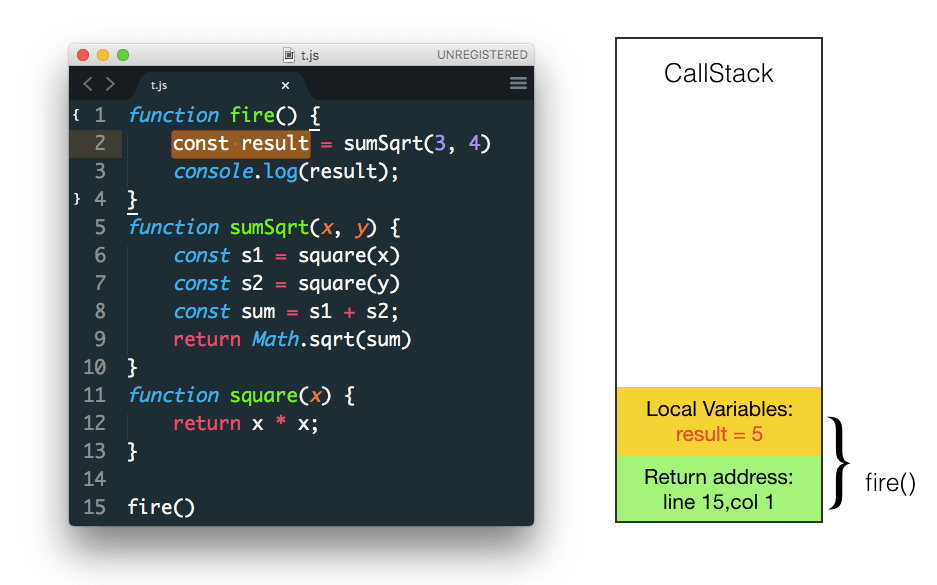


在 console 中打印出 result

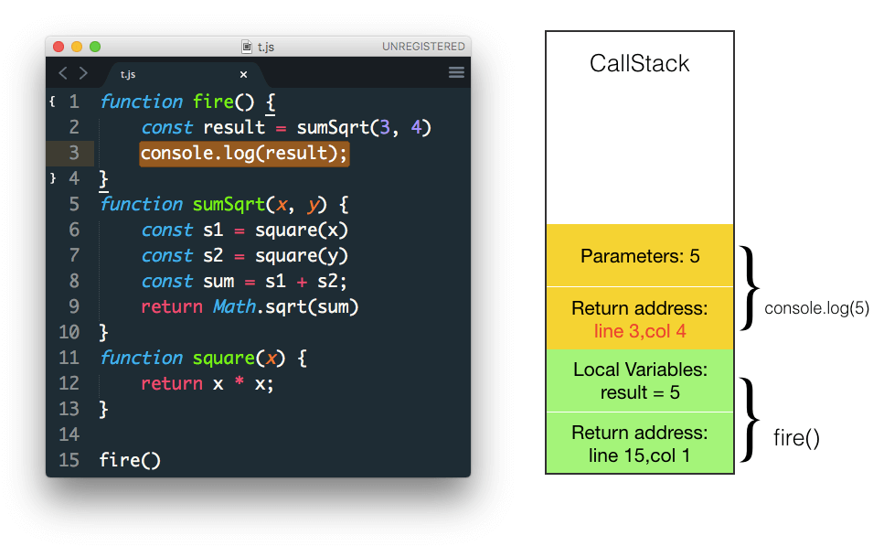


最终 `fire` 没有任何返回值 从stack中弹出 stack也清空了

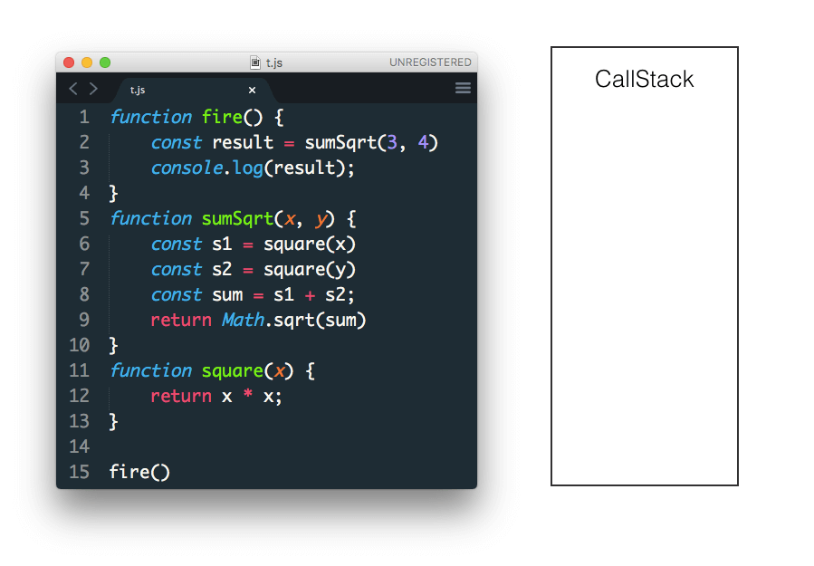

## Node.js 的事件循环


