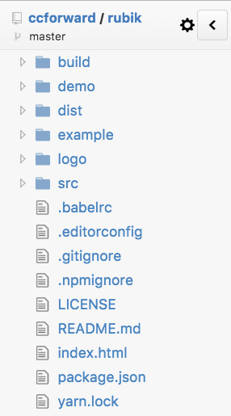
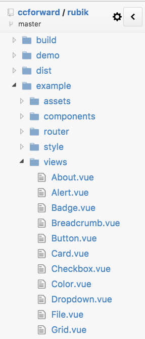

# Vue.js 组件库 Rubik UI 开发心得总结

Rubik UI 是一套基于 Vue 2.0 和 Material Design 开发的桌面端、移动端组件库

## 开发目的

因为公司内部系统开发的越来越多，而却同事们的要求也越来越高，不仅要好用而且要好看，看惯了 Bootstrap 自然会产生视觉疲劳，因此设计师同学的需求越来越多、后台系统各种体验不统一，因此就自发决定：

* 开发一套组件库，首先提升后台的可用性和用户体验
* 设计师 "轻" 参与，选定 Material Design 作为视觉的规范
* 尽可能保证组件库也能用于前台和移动端


## 设计、思考阶段

因为亲自从零参与并开发了几个后台，发现之前开发的各个业务组件的共性太低，不同后台业务需求差距也比较大，即使开发了通用的业务级组件，后续也跟不上需求的变化速度，因此只专注基础组件，同时也有利于保证组件库的 "轻量级" 特性和后续用于前台移动端的项目。

## 开发过程

### 确认视觉规范

这一步设计师来主导，制定基础的颜色、字体等规范。

因为决定参照 Material Design 的设计来开发，因此这一步进展的很快很顺利

其中这时候也确认了 LOGO 的设计：一个扁平化的魔方

### 确认基础组件

这是每一个组件库都会做的，我主要参考了 Bootstap 和 materializecss 的组件库，并结合业务中抽象出来的基础组件，最终确认了初期的组件开发任务。

### 确认技术栈

只支持 Vue.js 2.0+

Webpack + ES2015 + stylus 做 js 和 css 构建

Karma + mocha 做单元测试


### 组件示例

直接在项目目录下新建一个 `example` 目录，并结合 `Vue-Router` 开发成一个单页应用，每个单独 `view` 作为一个组件的 demo，目录如下：

 

这样就可以在 push master 分支的同时在 GitHub Pages 上作为官网展示了


### 文档

为了让用户看起来直观，所以文档中就必须存在各种示例，但是用 Markdown 写就无法添加实例。因此只能每个文档都暂时单独当做一个网页来处理。

后续的计划是写一个 Markdown 转 .vue 文件的 loader ，用 webpack 来处理文件转换。

### 遇到的问题

#### 自定义组件的原生事件

在 Vue 2.0 中的组定义组件上使用 `v-on` 就能直接监听自定义事件。

如果要监听原生事件就必须使用修饰符 `.native`

Vue 组件库 Element 的 Button 组件支持两种事件监听方式

```html
  <el-button @click.native="handleClick">Click Me!</el-button>
  <el-button @click="handleClick">Click Me!</el-button>
```

我根据尽量保持轻量和不打扰用户的原则，权衡之后决定只让用户自己决定事件的监听：

```html
  <r-btn info @click.native="handleClick">Button Click</r-btn>
```

而且任何自定义的组件都可以用 `@click.native="handleClick"` 的方式给跟组件添加事件监听

#### 事件机制 Event Bus

组件库中的组件之间肯定会有关联，而且父子组件之间也会通信，所以需要一套事件机制(简单的 pub/sub )来把所有的组件糅合在一起。

因为事件库起到了桥梁的作用，所以我起名叫 `util/bridge.js` ，其实叫 `bus.js` 或者 `events.js` 可能会更清晰点。

把 `bridge` 挂载到 `Vue.prototype.$rubik` 上，就很容易的通过 `this.$rubik.bridge` 在每个组件中进行事件的传递了。

bridge.js 如下：

```js
import EventEmitter from 'events'

class Bridge extends EventEmitter {
  constructor () {
    super()
    this.setMaxListeners(500)
  }

  sub (event, cb) {
    const type = typeof event

    if (type !== 'object' && type !== 'array') {
      return this.on(event, cb)
    }

    event.forEach(i => this.on.apply(this, i))
  }

  unsub (event, cb) {
    const type = typeof event

    if (type !== 'object' && type !== 'array') {
      return this.removeListener(event, cb)
    }
    
    event.forEach(i => this.removeListener.apply(this, i))
  }

  pub () {
    this.emit.apply(this, arguments)
  }
}

export default new Bridge()

```

当组件被销毁时，注册事件也要执行 `unsub`，因为有了 Vue 生命周期的 Hook ，所以很简单，只需要写一个 mixin: `mixins/event.js`

```js
export default {
  mounted () {
    this.$rubik.bridge.sub(this.events)
  },

  beforeDestroy () {
    this.$rubik.bridge.unsub(this.events)
  }
}
``` 

#### onload

因为有时候需要等待 DOM 加载成功后才去执行一些操作，所以在 `Vue` 的 `prototype.$rubik` 上添加了 `load` 方法，方便在各个组件中直接调用：

```js
mounted(){
  this.$rubik.load(this.init) 
}, 
methods: {
  init(){
    alert('Component ready!') 
  }
}
```

load.js 也很简单

```js
function load (cb) {
  if (document.readyState === 'complete') {
    return setTimeout(cb, 0)
  }

  if (document.readyState === 'interactive') {
    return setTimeout(() => load(cb), 150)
  }

  document.addEventListener('DOMContentLoaded', cb)
}

export default load
```

#### 表单的双向绑定

以 `r-input` 输入框为例，自定义组件的写法：`<r-input v-model="val"></r-input>`

直接在最外层使用 v-model 指令就可实现对 `<input>` 标签的双向数据绑定。

这是因为在组件内部监听了 `input` 事件

``` html
<input :value="inputValue" @input="val" />
```

然后手动触发 'input' 事件

```js
val (e) {
  this.inputValue = e.target.value
  this.$emit('input', this.inputValue)
}
```


#### 栅格样式

因为采用12栅格，所以模仿了 Bootstrap 生成栅格的sass写法，改成 stylus 的函数

``` stylus
for size, width in $grid-breakpoints
  &.{size}
    flex-grow 1
    flex-shrink 1
    
  @media only screen and (min-width: width)
    for n in (1..$grid-columns)
      &.{size}{n}
        flex-basis (n / $grid-columns * 100)%
        max-width (n / $grid-columns * 100)%
        
      &.offset-{size}{n}
        margin-left (n / $grid-columns * 100)%
```

根据变量 $grid-breakpoints

```stylus
$grid-breakpoints := {
  xs: 0
  sm: 576px
  md: 768px
  lg: 992px
}
```

只需要17行代码生成四种响应式380行左右的css样式代码


## 总结

因为一直都是一个人在开发，所以遇到了很多问题都是在社区中寻找到的答案，其中也踩了不少坑，但这也都是自己成长中不可多得的经验，虽然是个个人项目，但还是希望能不断的完善，无论有没有用户在用，至少都是自己的产品，慢慢打磨。
