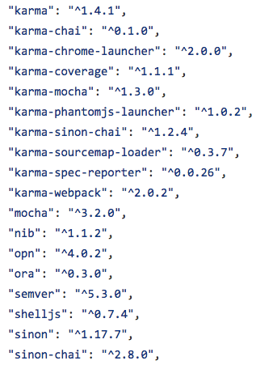

# Vue.js 项目使用 Karma 做自动化UI测试

> 内部测试代码不宜公开
> 因此以开源项目 Rubik UI 的测试代码为例子

## 环境

安装完 Karma 并自动生成 `karma.conf.js` 后  

选用 `mocha` 作为测试框架  

`chai` 作为断言库（添加 `sino-chai` 做扩展）  

用 Chrome 和 Phantom.js 浏览器  

同时测试代码还要用 `karma-webpack` 打包

最后用 `spec` 和 `karma-coverage` 来报告测试覆盖率

因此，需要安装一堆的插件...



## 配置

### karma.conf

重点要在 karma 自动生成的配置文件 karma.conf.js 基础上添加 `files` `preprocessors` `webpack` `plugins`

[完整的 karma.conf.js 文件](https://github.com/ccforward/rubik/blob/master/test/unit/karma.conf.js)

#### files 和 preprocessors

根据 Vue.js 官方提供的 [例子](https://github.com/vuejs-templates/webpack/blob/master/template/test/unit/index.js)

在 `karma.conf.js` 中 `files` 的配置为 `files: ['./file.js'],`

file.js 中对测试起最核心作用的代码如下：

```js
// require 所有的测试代码
const testsContext = require.context('./specs', true, /\.spec$/)
testsContext.keys().forEach(testsContext)
```

这里使用webpack的 require.context 来引入子目录 `specs` 下的所有 .spec.js 文件

`preprocessors` 的配置项为

```js
preprocessors: {
  './file.js': ['webpack', 'sourcemap', 'coverage']
},
```

即 `file.js` 中 require 的文件都需要 webpack 来打包处理

[完整的 file.js 文件](https://github.com/ccforward/rubik/blob/master/test/unit/file.js)

#### webpack

```js
const webpackConfig = require('../../build/webpack.test.conf');

{
  ...
  webpack: webpackConfig,
  ...
}
```

上面引入的 webpack.test.conf.js 文件和普通的 webpack 配置没什么差别，除了 `entry` 之外， `output` `resolve` 各种 `loader` 等等都需要加上.

> 这里为了看起来方便，直接把 webpack.base.conf.js 文件 copy 过来，再起基础上做的修改

[webpack.test.conf.js 文件](https://github.com/ccforward/rubik/blob/master/build/webpack.test.conf.js)

#### plugins

这一项很简单，把需要的插件全写进去

```js
{
  ...
  plugins: [
    'karma-webpack',
    'karma-sourcemap-loader',
    'karma-mocha',
    'karma-chai',
    'karma-sinon-chai',
    'karma-chrome-launcher',
    'karma-phantomjs-launcher',
    'karma-spec-reporter',
    'karma-coverage'
  ],
  ...
}
```

## 引入组件库

因为 Rubik UI 的引入需要两步

1. use: `Vue.use(Rubik)`
2. 在钩子函数 `mounted` 中初始化: `vm.$rubik.init()`  

因为 `init` 函数的本质是给 `body` 元素添加 click 或者 touchstar 事件，所以在测试中可以不考虑 `mounted` 钩子，只要存在 `body` 元素即可

同时上面配置中的 `file.js` 文件也会被 webpack 打包后在浏览器中加载，因此 Rubik UI 的初始化就放在了 `file.js` 中 

```js
import Vue from 'vue'
import { createVM } from './vm'
import Rubik from 'src/index.js'

Vue.use(Rubik)
// vm 是 Vue 的一个实例对象
const vm = createVM({}, true)
vm.$rubik.init()
```

> `createVM` 和 `vm.js` 下面会详细介绍

## Vue 的 Unit Test

关于 Unit Test 官方有[文档](https://vuejs.org/v2/guide/unit-testing.html#Writing-Testable-Components)

> 我们这里直接参考了组件库 Element UI 的一个 [工具函数](https://github.com/ElemeFE/element/blob/dev/test/unit/util.js) 后做了简单修改

在 [vm.js 文件中](https://github.com/ccforward/rubik/blob/master/test/unit/vm.js) 我们可以建立几个工具函数来生成 Vue 的实例

### createComponent

```js
// 创建一个 Vue 的实例对象
exports.createComponent = function(Component, props = {}, mounted = false) {
  if (props === true || props === false) {
    mounted = props
    props = {}
  }
  const elm = createElm() // 创建一个位于 body 上的空 div
  const Ctor = Vue.extend(Component)
  return new Ctor({ props }).$mount(mounted === false ? null : elm)
}
```

因为很多组件都是 `.vue` 的单文件组件，所以在测试中可以直接 `import` 进来用 `createComponent` 生成对应的实例挂载到 DOM 上

### createVM

```js
exports.createVM = function(Component, mounted = false) {
  const elm = createElm() // 创建一个位于 body 上的空 div

  if (Object.prototype.toString.call(Component) === '[object String]') {
    Component = { template: Component }
  }
  return new Vue(Component).$mount(mounted === false ? null : elm)
}
```

和 `createComponent` 很像，可直接传 template 生成更复杂的实例对象，比如

```js
createVM({
  template: `
    <div>
      <r-btn class="green white-text" v-dropdown:dropdown>下拉菜单</r-btn>
      <r-dropdown id="dropdown" right hover>
        <li><a class="dropdown-item" href="#">吃饭</a></li>
        <li><a class="dropdown-item" href="#">睡觉</a></li>
      </r-dropdown>
    </div>
  `
}, true)
```

通过 `createComponent` 和 `createVM` 连个函数就可以很灵活的生成 `.vue` 这种单文件组件和自定义标签的组件的 Vue 实例，然后模拟各种操作来执行单元测试


回到上面 引入组件库 一节中留下的问题

```js
// vm 是 Vue 的一个实例对象
const vm = createVM({}, true)
vm.$rubik.init()
```

通过 `createVM` 生成一个空的 Vue 实例对象 vm 后，vm 就可以直接调用 `init` 方法来注册事件了。

因为 `init` 函数已经挂载 Vue 的原型链上了

```js
Vue.prototype.$rubik = {
    ...
    init: Init,
    ...
  }
```

每一个单独的 Vue 实例对象都能方便调用 `init` 函数


## 测试

主要就是在 `*.spec.js` 中写各种测试用例

这一点就和组件、业务强相关了，有两点需要注意

1. 因为 Vue 采用异步更新的 DOM 的机制，所以一些依赖 DOM 更新的结果的断言需要在 `Vue.nextTick` 的回调中执行
2. 模拟鼠标、键盘的事件后的断言也要放在一个事件循环之后来执行，可以简单 `setTimeout( _ => { }, interval)`  interval 可以根据元素动画的执行时间来调整

模拟鼠标、键盘动作的代码也放在了 [vm.js文件](https://github.com/ccforward/rubik/blob/master/test/unit/vm.js#L57)中

```js
// 触发事件: mouseenter, mouseleave, mouseover, keyup, change, click...
exports.fireEvent = function(elm, name, ...opts) {
  let eventName;

  if (/^mouse|click/.test(name)) {
    eventName = 'MouseEvents'
  } else if (/^key/.test(name)) {
    eventName = 'KeyboardEvent'
  } else {
    eventName = 'HTMLEvents'
  }

  const evt = document.createEvent(eventName)
  evt.initEvent(name, ...opts)

  elm.dispatchEvent
    ? elm.dispatchEvent(evt)
    : elm.fireEvent('on' + name, evt)

  return elm
}
```

比如 raido 的一个测试用例 

```js
...
fireEvent(radio2, 'click')
setTimeout( _ => {        
  expect(vm.$data.color).to.be.equal('white')
  expect(radio1.checked).to.be.false
  expect(radio2.checked).to.be.true
  done()
}, 100)
...
```
在模拟了 `click` 之后经过 100ms 再执行断言

[radio.spec.js 详细代码](https://github.com/ccforward/rubik/blob/master/test/unit/specs/radio.spec.js#L49)

## 最后

* 测试用例从另一方面来说是个很好的 API 文档，在我实习时候师兄就告诉我看不懂代码就新先去看单元测试，看懂了测试用例就会使用 API 了
* 代码要易于测试，才是好代码。如果测试效率低，那必然生产环境也会效率低，易于测试就会易于生产。所以经过测试后重构的代码比直接去重构的代码质量肯定会高
* TDD 是很有效的编码方式，因为通过测试可以快速的反馈我们的设计思路，验证想法
* (感觉说了很多废话。。。)


