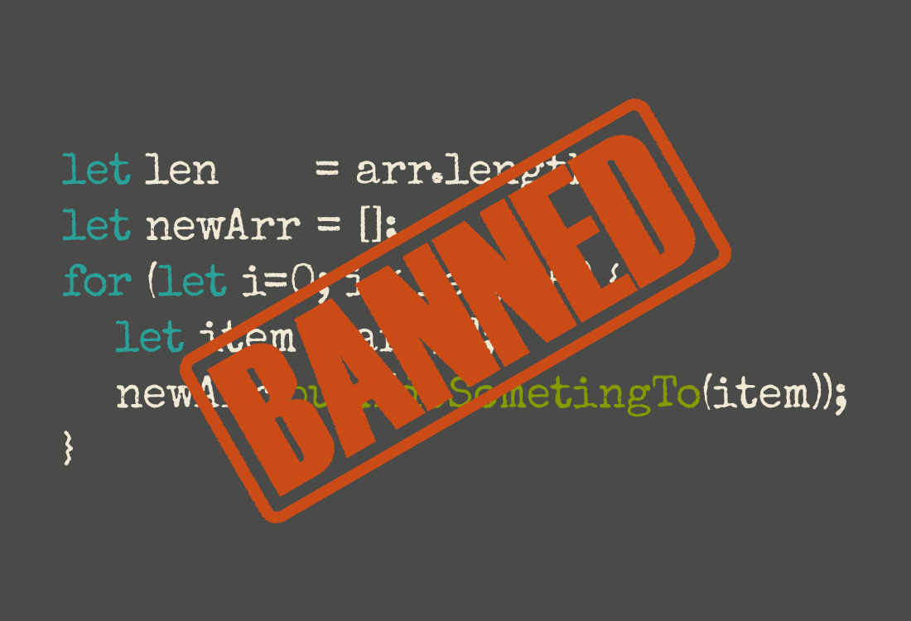

# 不用循环的 JavaScript -- 函数式编程



## 循环 Loop

先看看js中的基础循环代码 `while`

```js
// 所有字母大写
function capitalize(str){
  return str.replace(/[a-z]/g, s => s.toUpperCase())
}

const company = [
  'apple',
  'google',
  'amazon',
  'facebook'
]
```

使用 `while` 循环来大写数组中每个元素

```js
let i = 0
const len = company.length
const newCompany = []
while(i<len) {
  newCompany.push(capitalize(company[i]))
  i++
}
```

这种循环太常见了，一个初始值为0计数器 `i` ，每次循环需要递增i的值，并通过 `len` 来判断循环终止条件。  
简单的 `for` 循环代码如下：

```js
let i = 0
const len = company.length
const newCompany = []
for(; i<len; i++) {
  newCompany.push(capitalize(company[i]))
}
```

比起 `while` `for` 循环把计数器 `i` 放在循环顶部，避免了 `while` 中忘记计数器自增自增而引起的死循环。

但是后退一步看，我们只是要把每一项大写，但是并不在乎循环中的计数器 `i`

因为这种对数组每一项尽心循环操作的模式很常见，所以有了 ES2015 中的 `for..of` 循环

```js
const newCompany = []
for(let item of company) {
  newCompany.push(capitalize(item))
}
```

用了 `for...of` 省了计数器和循环终止的判断，也不需要抽取出数组每一项来处理

## 映射 Mapping

虽然 `for...of` 更简洁，但还是要初始 `newCompany` 并执行 `push`

如何做到更加精简

如果现在有两个数组需要 `capitalize` 呢

```js
const company = [
  'apple',
  'google',
  'amazon',
  'facebook'
]

const animal = [
  'dog',
  'cat',
  'pig'
]
```

两次循环 简单粗暴：

```js
const newCompany = []
for(let item of company) {
  newCompany.push(capitalize(item))
}
const newAnimal = []
for(let item of animal) {
  newAnimal.push(capitalize(item))
}

```

这看起来不是很 DRY (Don't repeat yourself) ，所以可以重构下

```js
function capitalizeArray(arr){
  const newArr = []
  for(let item of arr){
    newArr.push(capitalize(item))
  }

  return newArr
}
const newCompany = capitalizeArray(company)
const newAnimal = capitalizeArray(animal)
```

这样看起来还行，但是如果新加一个功能，只是首字母大写呢

```js
// 首字母大写
function capitalizeFirst(str){
  return str.replace(/( |^)[a-z]/, s => s.toUpperCase())
}
```

如果这样写，下面的代码依然不是很 DRY

```js
function capitalizeArray(arr){
  const newArr = []
  for(let item of arr){
    newArr.push(capitalize(item))
  }

  return newArr
}

function capitalizeFirstArray(arr){
  const newArr = []
  for(let item of arr){
    newArr.push(capitalizeFirst(item))
  }

  return newArr
}

```

那就继续重构，抽象成给定一个数组和一个函数，然后将数组中每一项映射到新的数组的模式

```js
function map(fn, arr) {
  const newArr = []
  for(let item of arr){
    newArr.push(fn(item))
  }

  return newArr
}
```

但代码里依然有个循环，只能写成递归的形式

```js
function map(fn, arr) {
  if(arr.length == 0) return []
  return fn(arr[0]).concat(map(fn, arr.slice(1)))
}
```

递归的代码极简，但在旧浏览器里有性能问题，所以我们就直接用 js 内置的 `map` 好了

同样简单粗暴

```js
const newCompany        = company.map(capitalize)
const firstUpperCompany = company.map(capitalizeFirst)
const newAnimal         = animal.map(capitalize)
const firstUpperAnimal  = animal.map(capitalizeFirst)
```

像函数式编程一样，两个用来做大写字符串的函数只关注本身的功能，不关心数据从哪来；同时 `map` 只负责传递函数，不关心函数是干什么的。


> 参考自 [http://jrsinclair.com/articles/2017/javascript-without-loops/](http://jrsinclair.com/articles/2017/javascript-without-loops/)
> 本文重写了代码、添加了个人的理解，更加精简