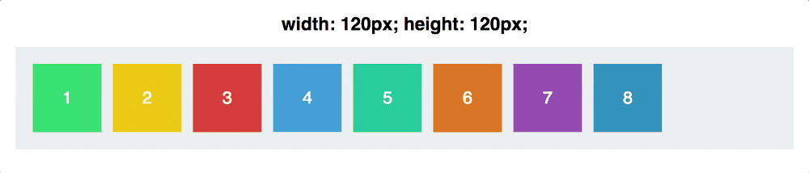
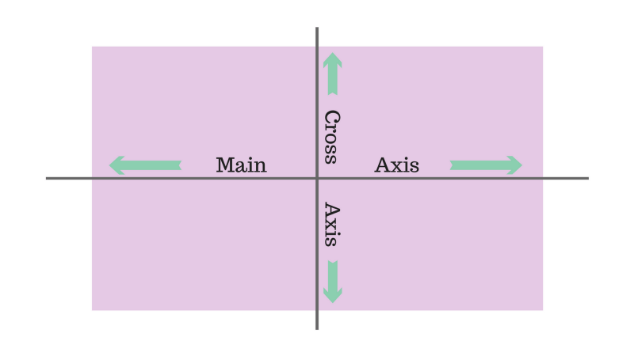
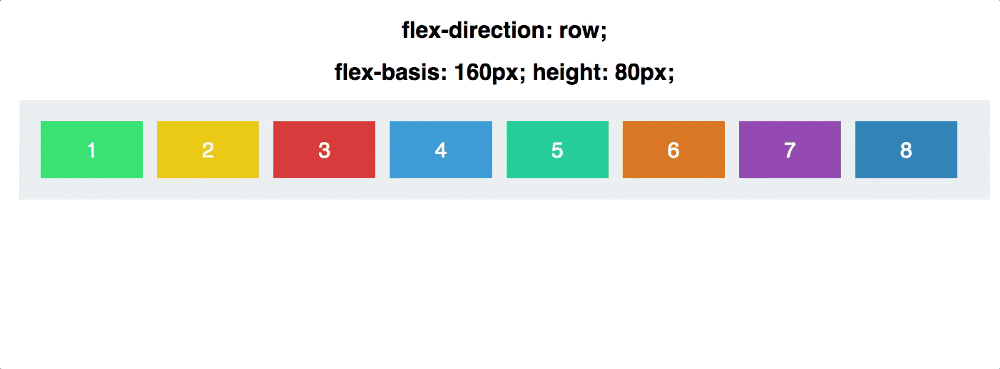
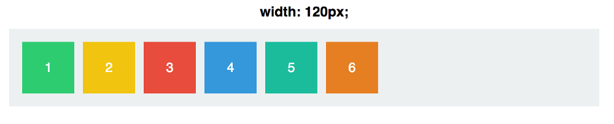
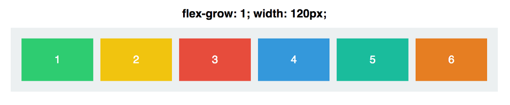
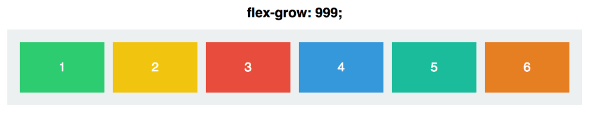
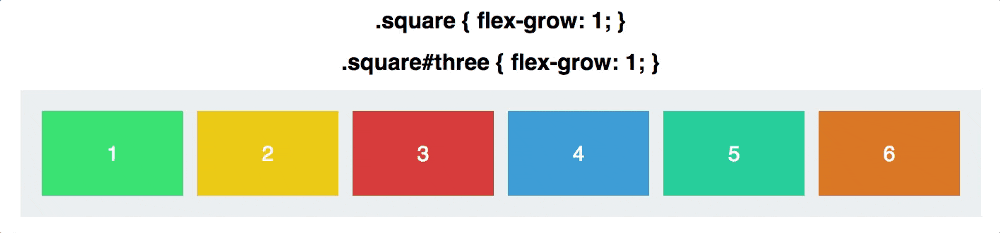
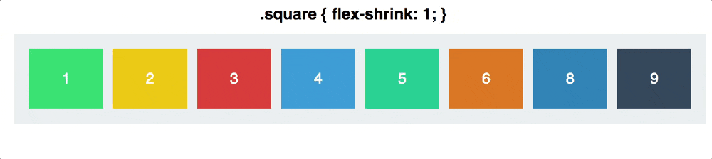
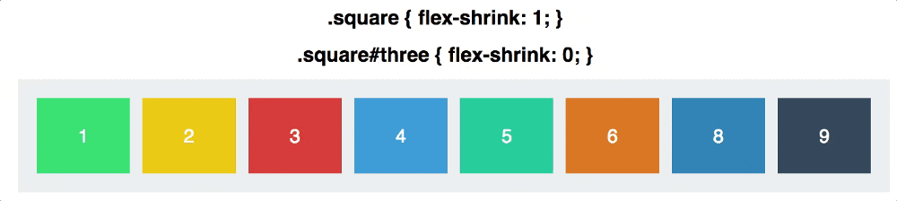
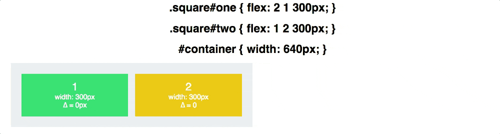

# 图解 Flexbox 2 - 深入理解

本文图片、部分翻译来自原文 [Even more about how Flexbox works — explained in big, colorful, animated gifs](https://medium.freecodecamp.com/even-more-about-how-flexbox-works-explained-in-big-colorful-animated-gifs-a5a74812b053)

上一篇 [53.图解 Flexbox](https://github.com/ccforward/cc/issues/57) 介绍了 Flexbox 的基本属性，这次来深入理解下。

## 属性 #1 `flex-basis`

上一篇主要看了容器元素的属性，这次来看下子元素

`flex-basis` 控制元素的默认尺寸，然后再由其他 Flexbox 属性控制

下图表示可以和 `width` 属性互换



那 `flex-basis` 和 `width` 又有什么区别呢，因为 Flexbox 的容器有两个轴 如下：



`flex-basis` 是通过主轴 (main axis) 来影响元素尺寸的

我们保持 `flex-basis` 不变，然后切换主轴方向 如下：



注意，我们必须从手动设置高度切换成手动设置高度。因此通过 `flex-direction` 的不同，`flex-basis` 会交替的影响 `width` 或 `height`

## 属性 #2 `flex-grow`

首先设置每个元素 `width` 为 120px ，如下：



`flex-grow` 的默认值为 0，意味着每个元素不能在容器内增长 (grow) 他们的宽度

如果设置 `flex-grow: 1` 呢，如下图：



每个元素在容器内均匀的充满了整个空间，`flex-grow` 的值覆盖了 `width`

那 `flex-grow: 1` 到底意味着什么呢，如果我们改为 `flex-grow: 999` 



完全一样，没有变化。那是因为 `flex-grow` 不是个绝对值，而是一个相对值。

起作用的不是一个元素的 `flex-grow` 的值，而是他相对于其他元素值。比如，我们改变三个元素的`flex-grow:` 其他元素不变 



这个其实很容易理解，就是按照百分比来占据空间：

当每个元素都为 `flex-grow: 1` ，一共6块， 每个元素占据空间的 1/6 宽度

当第三个元素 `flex-grow: 2` 时，整个父级空间切成7份 1+1+2+1+1+1。 第三个元素占据 2/7 ,其他元素为 1/7

同理，第三个元素 `flex-grow: 3` 第三个元素占据 3/8 ,其他元素为 1/8


`flex-grow` 的值是按比例来计算的，比如设置每个元素 `flex-grow: 4` ,第三个元素 `flex-grow: 12`, 其实和 1:3 一样的


`flex-grow` 和 `flex-basis` 一样是作用于主轴的。除非改变 `flex-direction: column` 否则元素只是改变宽度

## 属性 #3 `flex-shrink`

`flex-shrink` 的作用和 `flex-grow` 恰恰相反，来确定一个元素的缩小比例。（顾名思义，shrink 和 grow 就是一个缩小一个增长）

`flex-shrink` 的作用是指定哪些元素缩小哪些不缩小。默认情况每个元素 `flex-shrink: 1`,意味着他们会随着父级容器的缩小而缩小。

下图中每个元素都是 `flex-grow: 1` 他们会充满容器，同时每个元素 `flex-shrink: 1`, 他们是可以收缩的



如果把第三个元素设为 `flex-shrink: 0` 禁止缩小，所以他可以增长宽度适应容器，但是不会下降到 120px 以下



每个元素默认 `flex-shrink: 1`

`flex-shrink` 也是相对值，按比例来计算的，若果一个元素 `flex-shrink` 的值为6，其他的为2，当容器空间压缩时，该元素会以 3x 的速度缩小。这里的 3x 指的是将缩小 3倍，而不是缩小为 1/3 的宽度。

后面会有 `flex-shrink` 和 `flex-grow` 更详细的说明，先来个最后一个属性


## 属性 #34 `flex`

`flex` 属性是把 `flex-grow` `flex-shrink` `flex-basis` 综合到了一起

默认值为  0 (`flex-grow`) 1 (`flex-shrink`) auto (`flex-basis`)

最后一个例子，我们设置2个元素

```css
.square#one {
  flex: 2 1 300px;
}
.square#two {
  flex: 1 2 300px;
}
```
`flex-basis` 的值相同，他们都占据相同的空间 300px （容器算上 margin padding 是 600px）

但是 元素1 将会2x速度增长宽度， 元素2 将会2x速度缩小宽度 如下


##`flex-grow` 和 `flex-shrink` 是如何工作的

当 元素1 (.square#one) 增长时他不会增长到 元素2 (.square#two) 的两倍；同样缩小时 元素2 (.square#two) 也不会缩小为 元素1 (.square#one) 的一半

因此这不是他们的大小比例为 1:2 或者 2:1 ,而是他们的收缩和增长速度

### 简单计算下

容器初始宽度为 640px ，除去两边的各 20px 的 padding 后，两个元素各有 `flex-basis` 为 30px 

当容器设置为 430px 时，我们失去了 210px 的空间 元素1 `flex-shrink: 1` 减少了 70px ; 元素2 `flex-shrink: 2` 少了 140px

当容器设置为 340px 时，我们失去了 300px 的空间 元素1 减少了 100px ; 元素2 少了 200px

他们减少的比例正好也是 2:1


`flex-grow` 也是同样道理。当容器设置为 940px 时，增长的 300px 空间分别来自 元素1 的 200px 和 元素2 的 100px

直接用 `flex` 即可表达：



上图很容易看出元素的宽度是如何根据比例进行调整的


## 最后

`flex-basis` 控制着元素在沿着主轴上 grow 和 shrik 之前最终能够变化多大

`flex-grow` 决定了他将与兄弟元素成比例的增长多少，`flex-shrink` 决定了缩小多少


