# 性能分析


## 性能分析主要从以下几点出发
1. 加载
2. 图片
3. CSS
4. 渲染
5. 脚本

PS：我是用了tower上个人的测试项目来分析页面，主要上传了一些图片和三份文档markdown以及发起部分讨论。

分析时间：2015.08.02

### tower首页的 webpagetest 分析
[http://www.webpagetest.org/result/150730_39_2BQ/1/details/](http://www.webpagetest.org/result/150730_39_2BQ/1/details/)  
webpagetest站点给出了比较详细的性能分析说明，我们不再深入讨论。

### 加载

* HTTP请求数33个  总大小1.6M   
  DOMContentLoad 用时2.23s Load 用时 2.67s 如图：
  
  包括：
    * 1个 HTML 文档
    * 1个 css 文件
    * 6个 js 文件
    * 22张图片 (略多)
    * 1个字体文件 base64 格式
    * 1个用于推送的 websocket 请求
    * 1个 POST 的 ajax 推送请求

* 没有做 DNS 预加载 如图 html 文档的加载 timing
  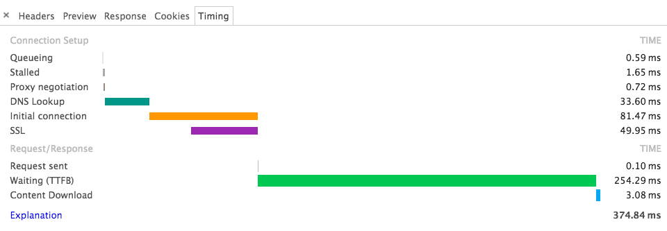
  DNS查询花了81ms 
  建议在html文档 head 标签中给各个域名添加DNS预查询 `<link rel="dns-prefetch" href="//avatar.tower.im">`
    * 比如：pusher.tower.im avatar.tower.im atttachments.tower.im
* html 文档的源码没有压缩 删除多余空格、空行会大大减小文档体积
  
* css 样式文件大小 500K gzip压缩后91k左右  
  TTFB 74ms 下载用了140ms  
  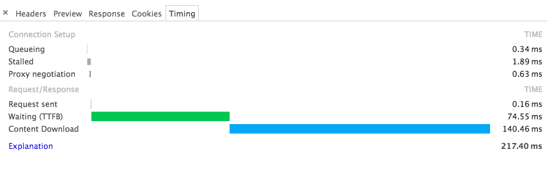
  可以权衡只加载首屏和框架的通用样式，组件的样式可以模块化懒加载，但是会增加请求数，增加服务器压力，增加流量、成本自然会增加；但如果样式分离有性能上质的飞跃还是可以考虑的。
* 看上面的 HTML 源码可知 application.js 文件放在了页面顶部，会阻塞页面的加载，因此感到很奇怪。
* js文件的加载如图：
  
  * 不知为什么还会有 7ms 的 DNS 查询时间
  * TTFB 和 CSS 文件一样 用了77ms左右 应该是因为访问了相同地址的阿里云服务器  
    之前看过 js css 域名对应的ip，和现在的不一样了，应该是做了负载均衡的效果
  * js文件很庞大有1.1M gzip压缩后仍有267K是所有请求中最大的 下载用了314ms
  * 像 css js 这些静态资源文件建议放入CDN中加速    
* 页面唯一的css 和 业务逻辑js 文件加载完成后加载一张头像图 avatar  
  这张图片文件用了单独的域名 `avatar.tower.im`， 但是和后面的上传文件的域名 `attachments.tower.im` 对应了相同的ip(115.29.166.52) 猜测应该都是在阿里云的服务器上，导致DNS查询还是用了7ms，而且 TTFB 用了近120ms  
  猜测这些图片应该都放在了cdn上，但因为都是图片在没有 DNS 预加载的前提下所以还是建议使用相同域名  
  当然图片较多的话使用所域名可以同时并发请求对性能还是很有帮助的
* 用于做页面实时推送的库：pusher.min.js  
  先来看下请求时间:
  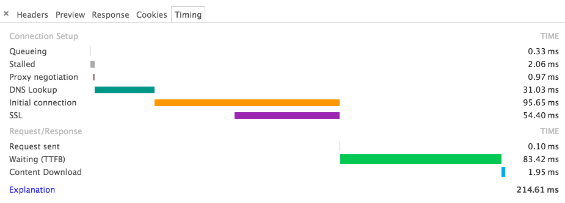
  DNS 查询竟然很恐怖的用了 31ms，但是gzip压缩后自由13K所以下载只用了1.95ms，超级快。  
  再看HTTP请求和响应头：
  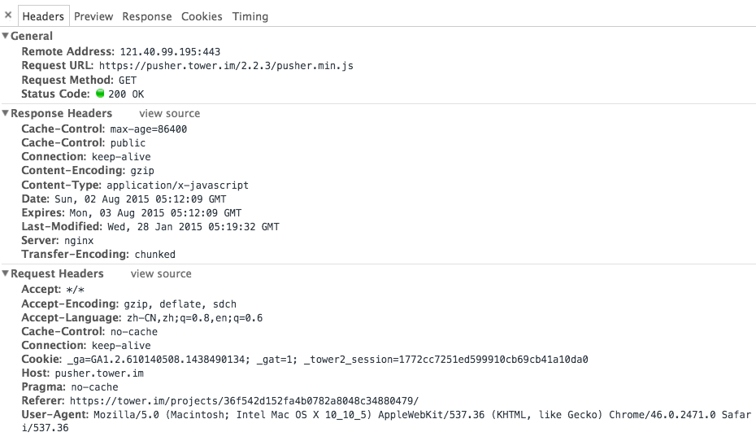
  响应头的 `Last-Modified:Wed, 28 Jan 2015 05:19:32 GMT`,估计这个独立的推送文件长时间不会修改，如果放入cdn中加载缓存效果可能会更好。单独放在push这个域名下个人猜测是为了方便对推送功能做统一管理  
  虽然有`Cache-Control:max-age=86400`而且做为一个长时间不修改的文件，如果像微信把js放入 localStorage 中缓存，应该会大大减少服务器请求次数 而且会减少一个相对比较大的请求
* 除了个人上传的图片需要单独请求之外，看到页面还有大量的 `/assets/` 下的小图片，好多不足1K 最大的 loading gif 图有14K大小，有些 icon 图片建议还是做sprite 图合并来减少请求
* 有两个应该是做统计用的js请求 其中一个域名是 `timing_nr-data.net` 在系统未设置翻墙时有时候会无法请求，翻墙后请求时间超长，如图：
  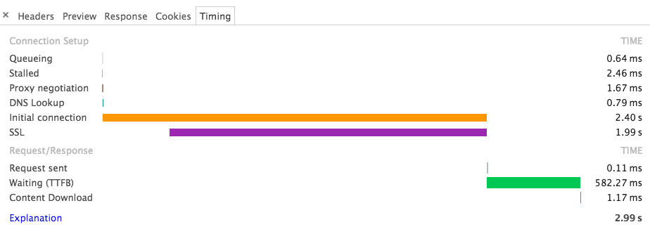
  查了下对应的ip `50.31.164.173` 指向的是美国，所以访问会很慢，不过只是发请求，不判断响应，而且是在页面最后，所以影响不是很大。
* 异步加载第三方资源：
  无论是google的分析文件还是另一个分析统计的js都是异步加载，不影响页面的加载和显示 


### 图片
* 发现页面中个人上传的图片没有用懒加载，虽然有些项目会把 `文件` 模块放在顶部，但是对于页面加载进来，暂时不需要看的图片还是通过lazyload来做按需加载来提升响应速度和降低总体流量。  
  但是这种按需加载会导致页面大量的重绘，影响渲染性能，所以还是要权衡的考虑。
* 文件模块中的大图片做了预加载
  当鼠标 hover 到缩略图时候对原图就做了请求，虽然可以在点击大图时候快速加载图片，但是也会出现加载原图后不点击查看的情况，而且还出现了相同图片多次加载的情况，这样会很浪费流量，尤其是类似照片的超大图。如图：
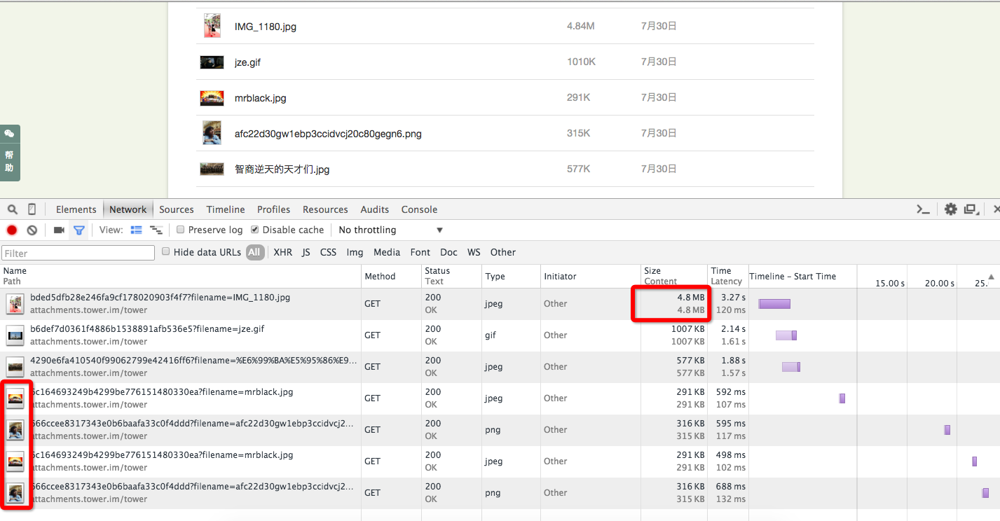
还有一张gif记录了整个过程，图片略大，建议在浏览器中打开查看(如果打不开，附件中还有原图)   
[图片预加载过程简单记录](http://7xiblh.com1.z0.glb.clouddn.com/1.gif)   
看了预加载的源码：

```
preloadImages: function(images, callback) {
    var base, i, imgObj, len, loadedImages, results, url;
    if ((base = arguments.callee).loadedImages || (base.loadedImages = {}), loadedImages = arguments.callee.loadedImages, "[object String]" === Object.prototype.toString.call(images)) images = [images];
    else if ("[object Array]" !== Object.prototype.toString.call(images)) return !1;
    for (results = [], i = 0, len = images.length; len > i; i++) url = images[i], !loadedImages[url] || callback ? (imgObj = new Image, callback && "[object Function]" === Object.prototype.toString.call(callback) && (imgObj.onload = function() {
        return loadedImages[url] = !0, callback(imgObj)
    }, imgObj.onerror = function() {
        return callback()
    }), results.push(imgObj.src = url)) : results.push(void 0);
    return results
},
```
图片的预加载是js请求的，对于超大图片建议加载大一点的缩略图，点击原图后再加载原图，对于流量节省效果估计会很明显。而且要避免相同图片重复请求的情况。  

对于预加载的图片，首先不建议直接加载原图，其次建议添加一个数组变量保存已经加载成功的图片链接以判断不再需要再次调用preloadImages函数

* icon loading 等资源图片压缩
下载了部分 icon 和 loading 图片，然后用mac上的 ImageOptim 应用做了无损压缩处理，效果还算明显：
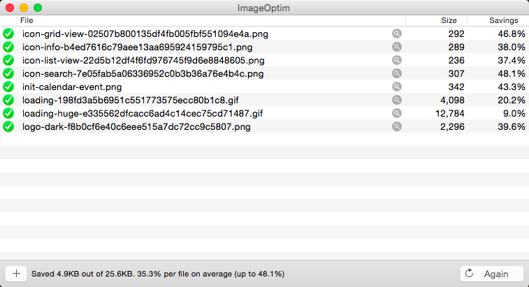  
腾讯出品的[智图](http://zhitu.tencent.com/)也可以做在线无损压缩还可以生成 webp 格式的图片


### CSS
把css文件下载后格式化 有26245行

* display: inline-block 后不应该再使用 float

	```
	.cal-event-click-popover .participants li
	.todolist .actions a 
	```
	在这几个选择器中发现了 `inlin-block` 后仍有 `float`
* 用了大量的 float , 其在渲染时计算量比较大建议 多用 `inline-block`
* 颜色 `#000000` 建议改为 `#000` 6位纯色的颜色值可改为3位
* 无前缀应放在最后 单页发现了这种写法

```
	transition-delay: 0.1s;
	-moz-transition-delay: 0.1s;
	-webkit-transition-delay: 0.1s
```


css对性能的影响不是很大，所以没有细致的区分析，但是出现了**大量的重复代码** 如下：

* 这段代码在css中大量重复存在  26K+行代码中 重复了97次

```
@font-face {
    font-family: "towericon";
    src: url(/assets/towericon-43a15ff635d9a6c4cd217f8dd9f6b9a9.eot);
    src: url(/assets/towericon.eot?#iefix) format("embedded-opentype"), url(/assets/towericon-59b8a2eb2d5f57348c46e4b76e7b3b48.woff) format("woff"), url(/assets/towericon-d73876644e9a8e2359fe19f21f1a1ce3.ttf) format("truetype")
}
```

* 重复了67次

```
.text-overflow {
    overflow: hidden;
    white-space: nowrap;
    text-overflow: ellipsis
}
```

* 重复96次

```
.break-word {
    word-break: break-all;
    word-wrap: break-word
}
```

* 重复97次

```
.font-bold {
    font-weight: bold;
    font-family: arial, sans-serif
}
```

* 重复49次  
这种 `media query` 下的样式最好写在一起

```
@media all and (-webkit-min-device-pixel-ratio: 1.5),
all and (-o-min-device-pixel-ratio: 3 / 2),
all and (min--moz-device-pixel-ratio: 1.5),
all and (min-device-pixel-ratio: 1.5)
```
用 grunt 插件应该在合并时候可以处理掉  
或者用 less 或者 sass 对通用样式做统一的函数处理，一次统一调用 不重复


### 移动端
移动端的页面没怎么去分析，移动端个人猜测主要还是用 app 的人比较多

* 移动端页面的业务逻辑js放在了页面底部不阻塞加载，但是这个js文件还是太大了，gzip之后有140K大小  
  看了js的部分源码，使用了jQuery 2.1.4 ，其中sizzle模块占据了大头，移动端应该不要有太多的dom操作，建议使用原生的dom选择器 `querySelectorAll`  
  我们之前移动web开发使用了 zepto ，很轻量
* 其中移动端的页面的loading图也用了相同的gif(大小29K)，移动端的页面我们是极力避免使用gif图片的，因为无论是占用内存还是解析都会很吃力，建议使用css3的loading动画替代
* 其中移动端最影响性能的一点是：进入一个项目详情页面，不做任何操作的页面加载如下：

竟然有57个请求，图片50张全部加载，，这些图片的来源主要是 `文件` 选项卡中个人上传的图片，虽然看了图片链接中添加了参数 `version=small` ，但是如果某些配置不高的机型加载页面会导致比较严重的卡顿，还是有和PC端一样的建议：**图片懒加载**
* 因为联通3G网络平均338KB/s(2.71Mb/s），所以首屏资源不应超过1014KB，因为我们tower页面图片并不是主要内容，所以页面请求的资源并不是很大
* 看了下mobile的css：  
  * 有一段代码，id选择器竟然是这样用 `.simple-mobile-selectmenu .selectmenu-control a#link-finish`   
  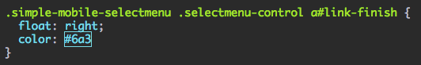
  * 这里有个gif图的请求挂掉了 [tiny-loading.gif](https://tower.im/assets/assets/tiny-loading.gif)
  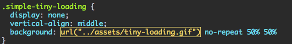
  * css3需要写前缀的属性书序有些问题，无前缀的应该在最下面  
  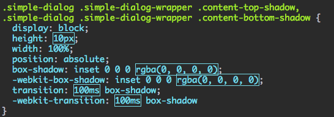
  而且已经 `position: absolute;` 不需要 `display: block;`
  * 移动端的css和PC端一样有大量重复代码的问题
  * 这种代码可以合并为一个 `background` 属性
  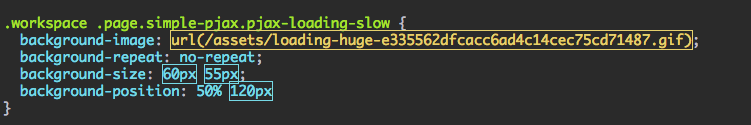 
* 缓存  
  移动端缓存建议使用 manifest ，对于不经常改变的css可以抽取成模块直接缓存在本地  
  同样的js文件也可以把moment、fastclick等模块抽取出来放在localStorage中缓存

  
### 其他
* 看 timeline 的截图中的 RECORDS ，其实页面 DOMContentLoad 之前一直处于大量请求的过程，主要是各种图片资源  
  在页面contentload之后，会有大量的页面重绘`paint`  
  timeline.json已经保存下来
* 使用的 chrome canary 在页面打开上传的markdown文件会有乱码 改为UTF-8后正常 如图：

* 很多post请求直接返回html结构，可以返回json直接在客户端做渲染，html模板只在客户端保存一次，也就是只有一次模板请求，会节省很多流量。


##### 域名 IP 对应
* 115.29.166.52 attachments.tower.im 上传的图片
* 121.41.22.250 tower.im/assets assets 图片
* 112.124.24.183 html、 css、assets/application.js 负载均衡
* 115.29.166.181 html、 css、assets/application.js 负载均衡
* 121.41.22.250 pjax请求页面 正常页面链接添加参数pjax=1
* 115.29.166.181 图片转移文件夹的请求
* 115.29.166.181 post 桌面通知请求
* 121.41.22.250 删除图片请求
* 121.40.99.195 pusher.tower.im pusher
* 115.29.166.52 avatar.tower.im
* 115.29.166.52 s.tower.im/emoji


